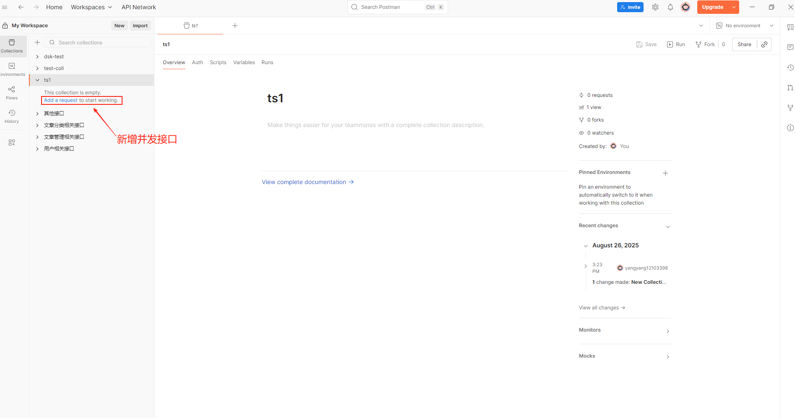

# springboot 分布式锁的应用以及并发测试

# 1.创建并发接口

- 分布式锁依赖redis，所以在pom文件中引入如下两个必须依赖

```
<!--redis坐标-->
<dependency>
    <groupId>org.springframework.boot</groupId>
    <artifactId>spring-boot-starter-data-redis</artifactId>
</dependency>
<!-- https://mvnrepository.com/artifact/org.redisson/redisson-spring-boot-starter -->
<dependency>
    <groupId>org.redisson</groupId>
    <artifactId>redisson-spring-boot-starter</artifactId>
    <version>3.22.1</version>
</dependency>
```

- 在yml中进行配置，spring boot3配置层级如下和springboot2配置不一样，所以需要特别注意

```
spring:
  data:
    redis:
      host: 192.168.2.119
      port: 6379
      database: 0
      lettuce:
        pool:
          max-active: 8      # 连接池最大连接数
          min-idle: 2     # 最小空闲连接
```

- 创建分布式锁工具类

```
package com.yy.redis.utils;

import com.yy.common.exception.LockInterruptedException;
import com.yy.common.exception.LockTimeoutException;
import jakarta.annotation.PostConstruct;
import jakarta.annotation.Resource;
import lombok.extern.slf4j.Slf4j;
import org.apache.commons.lang3.StringUtils;
import org.redisson.api.RLock;
import org.redisson.api.RedissonClient;
import org.springframework.stereotype.Component;

import java.util.concurrent.TimeUnit;
import java.util.function.Supplier;

/**
 * 分布式锁工具类
 * @ClassName RedissonLockUtil
 * @Author yangfeng
 * @Date 2025/8/22 16:04
 * @Version 1.0
 */
@Slf4j
@Component
public class RedissonLockUtil {

    private static RedissonClient staticRedissonClient;
    @Resource
    private RedissonClient redissonClient;

    private RedissonLockUtil() {

    }


    public static <T> T lockRun(
            String lockName, long waitTime, long leaseTime,
            TimeUnit timeUnit, Supplier<T> task) {

        // 1. 参数校验
        if (StringUtils.isBlank(lockName))
            throw new IllegalArgumentException("锁名称不能为空");
        if (task == null)
            throw new IllegalArgumentException("任务不能为空");

        RLock rLock = staticRedissonClient.getLock(lockName);
        boolean acquired = false;
        try {
            log.info("线程[{}]尝试获取锁: {}", Thread.currentThread().getId(), lockName);
            // 启用看门狗（leaseTime = -1）
            acquired = rLock.tryLock(waitTime, leaseTime>0?leaseTime:-1, timeUnit);

            if (acquired) {
                return task.get();
            } else {
                log.warn("锁获取超时: {} (等待时间: {}{})", lockName, waitTime, timeUnit);
                throw new LockTimeoutException("资源忙，请重试");
            }
        } catch (InterruptedException e) {
            Thread.currentThread().interrupt();
            log.error("锁等待被中断: {}", lockName, e);
            throw new LockInterruptedException("操作中断", e);
        } finally {
            if (acquired && rLock.isHeldByCurrentThread()) {
                try {
                    rLock.unlock();
                    log.debug("锁释放成功: {}", lockName);
                } catch (IllegalMonitorStateException ex) {
                    log.warn("锁【{}】已自动释放", lockName);
                } catch (Exception e) {
                    log.error("锁【{}】释放异常", lockName, e);
                }
            }
        }
    }
    /**
     * 锁定并执行，不需要返回值
     * @param lockName
     * @param waitTime
     * @param leaseTime
     * @param timeUnit
     * @param task
     * @Return: void
     * @author: yangfeng
     * @date: 2025/8/22 16:54
     **/
    public static void lockRun(
            String lockName,
            long waitTime,
            long leaseTime,
            TimeUnit timeUnit,
            Runnable task
    ) {
        RedissonLockUtil.lockRun(
                lockName,
                waitTime,
                leaseTime,
                timeUnit,
                () -> {
                    task.run();
                    return null;
                }
        );
    }
    @PostConstruct
    public void init() {
        staticRedissonClient = redissonClient; // 实例 → 静态
    }


}
```

创建并发的service接口

```
package com.yy.redis.service;

/**
 * 测试service
 *
 * @ClassName TestService
 * @Author yangfeng
 * @Date 2025/8/22 17:08
 * @Version 1.0
 */
public interface TestService {
    void createOrder(String id);
    boolean processPayment(String orderId);
}
```

创建并发接口实现类impl

```
package com.yy.redis.service.impl;

import com.yy.redis.service.TestService;
import com.yy.redis.utils.RedissonLockUtil;
import jakarta.annotation.PostConstruct;
import lombok.extern.slf4j.Slf4j;
import org.springframework.stereotype.Service;

import java.time.LocalDateTime;
import java.util.concurrent.TimeUnit;

/**
 * 替换描述
 *
 * @ClassName TestServiceImpl
 * @Author yangfeng
 * @Date 2025/8/22 17:09
 * @Version 1.0
 */
@Service
@Slf4j
public class TestServiceImpl implements TestService {
    public void createOrder(String id) {
        log.info("service创建订单{}",Thread.currentThread().getId());
        // 调用锁方法，无返回值时使用 Runnable
        RedissonLockUtil.lockRun(
                "order:create:" + id, // 锁名称（业务语义化）
                5l,            // 等待3秒
                -10l, TimeUnit.SECONDS,             // 看门狗自动续期（leaseTime=-1）
                () -> {
                    // 加锁后的业务逻辑
                    query(id);
                }
        );
    }

    private void query(String id){

        log.info("线程{}于{}执行订单查询{}",Thread.currentThread().getId(), LocalDateTime.now(),id);
        try {
            //模拟业务执行，休眠3秒
            Thread.sleep(1000*3);
        } catch (InterruptedException e) {
            throw new RuntimeException(e);
        }
        log.info("查询完成");
    }
    public boolean processPayment(String orderId) {
        // 调用锁方法，通过 Supplier 返回布尔值
        return RedissonLockUtil.lockRun(
                "payment:process:" + orderId,
                5,
                -1, TimeUnit.SECONDS,
                () -> {
                    return update(orderId); // 返回支付结果
                }
        );
    }
    private boolean update(String id){
        log.info("线程{}于{}执行订单更新{}",Thread.currentThread().getId(), LocalDateTime.now(),id);
        return false;
    }
}
```

创建controller并添加方法

```
package com.yy.redis.controller;

import com.yy.redis.service.TestService;
import lombok.RequiredArgsConstructor;
import lombok.extern.slf4j.Slf4j;
import org.springframework.web.bind.annotation.PostMapping;
import org.springframework.web.bind.annotation.RequestMapping;
import org.springframework.web.bind.annotation.RestController;

/**
 * 测试controller
 * @ClassName TestController
 * @Author yangfeng
 * @Date 2025/8/25 11:14
 * @Version 1.0
 */
@RestController
@RequestMapping("/test")
@Slf4j
@RequiredArgsConstructor
public class TestController {
    private final TestService testService;
    @PostMapping("/createOrder")
    public String createOrder(){
        log.info("创建订单{}",Thread.currentThread().getId());
        testService.createOrder("123");
        return "test";
    }


}
```

# 2.postman并发测试详细步骤

1. 打开postman

2. 创建collections集

   

3. 在集合中添加需要并发执行的接口

   

4. 右键集合，点击“Run”进行测试

   

5.点击run后进入到如下界面


6.点击切换到并发测试选项卡


点击红的的"Run"按钮开始执行测试

# redis 的序列化和配置设置

在依赖中添加如下pom文件

```
<dependency>
    <groupId>com.fasterxml.jackson.core</groupId>
    <artifactId>jackson-databind</artifactId>
</dependency>
<dependency>
    <groupId>com.fasterxml.jackson.datatype</groupId>
    <artifactId>jackson-datatype-jsr310</artifactId> <!-- 支持 Java 8 时间类型 -->
</dependency>
```

添加JacksonConfig

```
package com.yy.redis.config;

import com.fasterxml.jackson.databind.ObjectMapper;
import com.fasterxml.jackson.databind.SerializationFeature;
import com.fasterxml.jackson.databind.jsontype.impl.LaissezFaireSubTypeValidator;
import com.fasterxml.jackson.datatype.jsr310.JavaTimeModule;
import org.springframework.context.annotation.Bean;
import org.springframework.context.annotation.Configuration;

@Configuration
public class JacksonConfig {
    @Bean
    public ObjectMapper objectMapper() {
        ObjectMapper mapper = new ObjectMapper();
        mapper.registerModule(new JavaTimeModule()); // 支持 LocalDateTime
        mapper.disable(SerializationFeature.WRITE_DATES_AS_TIMESTAMPS); // 日期转字符串
        mapper.activateDefaultTyping( // 启用类型信息存储
            LaissezFaireSubTypeValidator.instance,
            ObjectMapper.DefaultTyping.NON_FINAL
        );
        return mapper;
    }
}
```

添加RedisConfig

```
package com.yy.redis.config;

import com.fasterxml.jackson.databind.ObjectMapper;
import org.springframework.context.annotation.Bean;
import org.springframework.context.annotation.Configuration;
import org.springframework.data.redis.connection.RedisConnectionFactory;
import org.springframework.data.redis.core.RedisTemplate;
import org.springframework.data.redis.serializer.GenericJackson2JsonRedisSerializer;
import org.springframework.data.redis.serializer.StringRedisSerializer;

@Configuration
public class RedisConfig {

    @Bean
    public RedisTemplate<String, Object> redisTemplate(
            RedisConnectionFactory factory,
            ObjectMapper objectMapper // 注入全局 ObjectMapper
    ) {
        RedisTemplate<String, Object> template = new RedisTemplate<>();
        template.setConnectionFactory(factory);

        // Key 序列化为字符串
        template.setKeySerializer(new StringRedisSerializer());
        template.setHashKeySerializer(new StringRedisSerializer());

        // Value 使用 GenericJackson2JsonRedisSerializer
        GenericJackson2JsonRedisSerializer serializer =
                new GenericJackson2JsonRedisSerializer(objectMapper); // ✅ 构造函数注入

        template.setValueSerializer(serializer);
        template.setHashValueSerializer(serializer);

        template.afterPropertiesSet();
        return template;
    }
}
```


添加测试的实体类Student

```
package com.yy.redis.domain;

import lombok.Data;

import java.time.LocalDateTime;

/**
 * 学生实体类
 * @ClassName Student
 * @Author yangfeng
 * @Date 2025/8/28 10:55
 * @Version 1.0
 */
@Data
public class Student {

    private String name;

    private Integer age;

    private LocalDateTime birthday;
}
```

添加测试类

```
package com.yy.redis;

import com.yy.redis.domain.Student;
import jakarta.annotation.Resource;
import org.junit.jupiter.api.Test;
import org.springframework.boot.test.context.SpringBootTest;
import org.springframework.data.redis.core.RedisTemplate;

import java.time.LocalDateTime;
import java.util.Arrays;
import java.util.List;

/**
 * redis基础测试
 * @ClassName RedisBasicTest
 * @Author yangfeng
 * @Date 2025/8/28 10:58
 * @Version 1.0
 */
@SpringBootTest
public class RedisBasicTest {
    @Resource
    RedisTemplate<String, Object> redisTemplate;


    @Test
    public void testSetObj(){
        Student student = new Student();
        student.setName("三");
        student.setAge(18);
        student.setBirthday(LocalDateTime.now());
        redisTemplate.opsForValue().set("stu1",student);
    }

    @Test
    public void testGetObj(){
        Student student1 = (Student)redisTemplate.opsForValue().get("stu1");
        System.out.println(student1);
    }
    @Test
    public void testSetList(){
        Student student1 = new Student();
        student1.setName("三");
        student1.setAge(18);
        student1.setBirthday(LocalDateTime.now());
        Student student2 = new Student();
        student2.setName("李四");
        student2.setAge(19);
        student2.setBirthday(LocalDateTime.now());
        redisTemplate.opsForValue().set("stu2", Arrays.asList(student1,student2));
    }
    @Test
    public void testGetList(){
        List<Student> students = (List<Student>)redisTemplate.opsForValue().get("stu2");
        System.out.println(students);
    }
}
```

