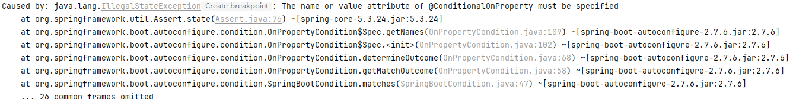
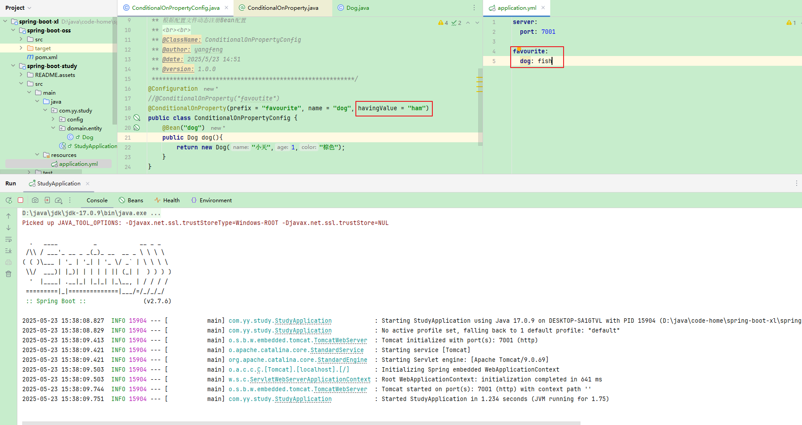
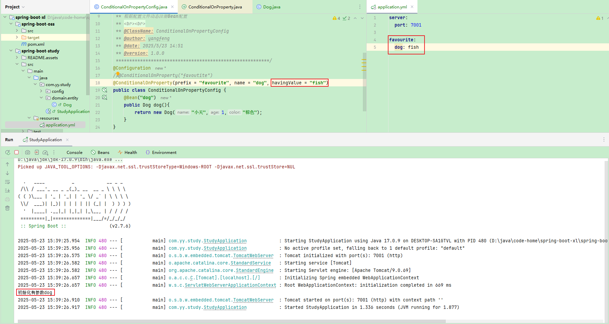

# 1.springboot之@Conditional注解的条件化注册机制详解

## 1.1@conditionalOnProperty

@ConditionalOnProperty` 是 Spring Boot 中用于 **根据配置文件属性动态控制 Bean 或配置类加载** 的核心条件注解。它通过读取 `application.properties`/`application.yml` 中的属性值，决定是否将特定组件注册到 Spring 容器中，是配置驱动开发的利器

参考连接 https://www.cnblogs.com/xiaomaomao/p/14012795.html

@ConditionalOnProperty 在使用时必须指定value或者name，如果两者都不指定，则启动时会报错



源码

```
package org.springframework.boot.autoconfigure.condition;

import java.lang.annotation.Documented;
import java.lang.annotation.ElementType;
import java.lang.annotation.Retention;
import java.lang.annotation.RetentionPolicy;
import java.lang.annotation.Target;

import org.springframework.context.annotation.Conditional;
import org.springframework.core.env.Environment;

@Retention(RetentionPolicy.RUNTIME)
@Target({ ElementType.TYPE, ElementType.METHOD })
@Documented
@Conditional(OnPropertyCondition.class)
public @interface ConditionalOnProperty {

	String[] value() default {};
	/**
	 * A prefix that should be applied to each property. The prefix automatically ends
	 * with a dot if not specified. A valid prefix is defined by one or more words
	 * separated with dots (e.g. {@code "acme.system.feature"}).
	 * @return the prefix
	 */
	String prefix() default "";

	/**
	 * The name of the properties to test. If a prefix has been defined, it is applied to
	 * compute the full key of each property. For instance if the prefix is
	 * {@code app.config} and one value is {@code my-value}, the full key would be
	 * {@code app.config.my-value}
	 * <p>
	 * Use the dashed notation to specify each property, that is all lower case with a "-"
	 * to separate words (e.g. {@code my-long-property}).
	 * @return the names
	 */
	String[] name() default {};

	/**
	 * The string representation of the expected value for the properties. If not
	 * specified, the property must <strong>not</strong> be equal to {@code false}.
	 * @return the expected value
	 */
	String havingValue() default "";

	/**
	 * Specify if the condition should match if the property is not set. Defaults to
	 * {@code false}.
	 * @return if the condition should match if the property is missing
	 */
	boolean matchIfMissing() default false;

}

```


只配置value属性，如果只有一个value属性，那么value属性可以省略不写

```
@Configuration
@ConditionalOnProperty("favoutite")
public class ConditionalOnPropertyConfig {
    @Bean("dog")
    public Dog dog(){
        return new Dog("小天",1,"棕色");
    }
}
```

prefix、name、havingValue()

prefix不可单独使用，必须和name组合才能代表一个完整的value，也就是prefix+name的组合和value指定的效果是一样的

配置的属性值和配置文件中的属性值不一致，所以注册条件不成立不进行注册



配置文件和注解中配置的条件一致：



#### `matchIfMissing` 的作用与默认值

1. **功能定义**

   ```
   matchIfMissing = true
   ```

   **：当配置文件中未声明目标属性时，条件视为满足，自动配置生效

   。

   - **

     ```
     matchIfMissing = false
     ```

     （默认值）**：未声明属性时条件不满足，自动配置不生效

     。

2. **典型场景**

   - **默认启用功能**：若希望某个组件在未显式配置时默认激活（如日志模块），设为 `true`。
   - **显式配置依赖**：若功能需用户主动配置才能启用（如第三方服务开关），保持默认 `false`。

2.ThreadLocal - 原理与应用场景详解

参考链接：https://developer.aliyun.com/article/1661553

**简介：** ThreadLocal是Java中用于实现线程隔离的重要工具，为每个线程提供独立的变量副本，避免多线程数据共享带来的安全问题。其核心原理是通过 ThreadLocalMap 实现键值对存储，每个线程维护自己的存储空间。ThreadLocal 广泛应用于线程隔离、跨层数据传递、复杂调用链路的全局参数传递及数据库连接管理等场景。此外，InheritableThreadLocal 支持子线程继承父线程的变量值，而 TransmittableThreadLocal 则解决了线程池中变量传递的问题，提升了多线程上下文管理的可靠性。深入理解这些机制，有助于开发者更好地解决多线程环境下的数据隔离与共享挑战。

# ThreadLocal 的基础概念

在 Java 的多线程世界里，线程之间的数据共享与隔离一直是一个关键话题。如果处理不当，很容易引发线程安全问题，比如数据混乱、脏读等。而 `ThreadLocal` 这个工具类，就像是为线程量身定制的 “私人储物柜”，为每个线程提供了独立的存储空间，完美地解决了**线程间数据隔离的问题**

## ThreadLocal 是什么？

`ThreadLocal` 是 Java 中一个非常实用的类，它为每个线程都提供了自己独立的变量副本。换句话说，每个线程都可以通过 `ThreadLocal` 来设置（`set`）和获取（`get`）自己的私有变量，而不会和其他线程产生任何干扰，就像每个线程都有自己的 “小金库”，互不干扰，互不影响。

举个简单的例子，假如我们有一个变量 `count`，在普通情况下，多个线程同时访问这个变量时，很容易出现数据混乱的情况，因为它们都操作的是同一个内存地址的变量。但如果我们把 `count` 放到 `ThreadLocal` 中，那么每个线程都会有自己独立的 `count` 副本，线程 A 对它的 `count` 副本进行修改，完全不会影响到线程 B 的 `count` 副本。

## ThreadLocal 的基本功能与特点

- **线程隔离** ：这是 `ThreadLocal` 最显著的特点。每个线程对 `ThreadLocal` 变量的读写操作都局限在自己的线程内，完全不会与其他线程产生数据共享或冲突。这种线程隔离的特性使得 `ThreadLocal` 在处理一些需要线程私有数据的场景时非常有用，比如在每个线程中保存独立的配置信息、用户身份信息等。
- **无需显式加锁** ：由于线程间的数据隔离，使用 `ThreadLocal` 变量时，不需要像操作共享变量那样使用显式的锁机制（如 `synchronized` 或 `ReentrantLock`）来保证线程安全。这大大简化了多线程编程的复杂度，提高了开发效率。


https://developer.aliyun.com/article/1229735  拦截器

https://cloud.tencent.com/developer/article/2421824?policyId=1003  日志追踪

https://cloud.tencent.com/developer/article/1913487  日志追踪

https://developer.aliyun.com/article/1661553  ThreadLocal

